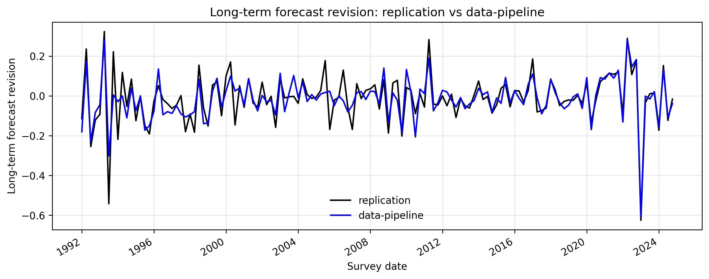
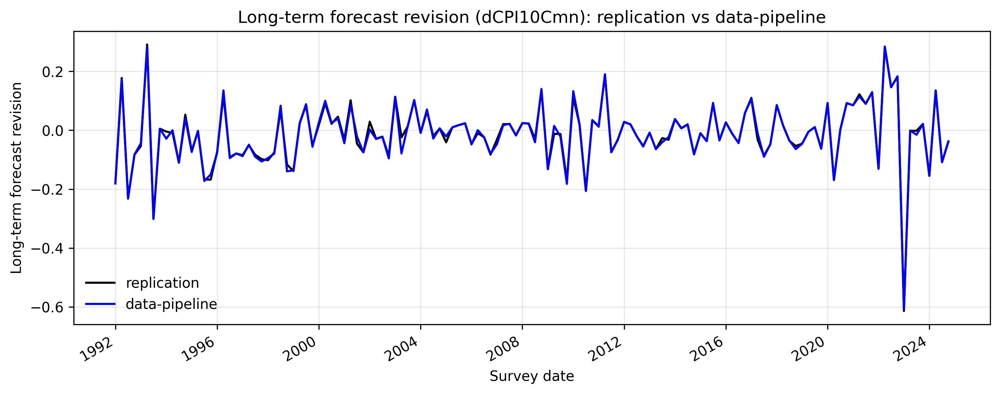
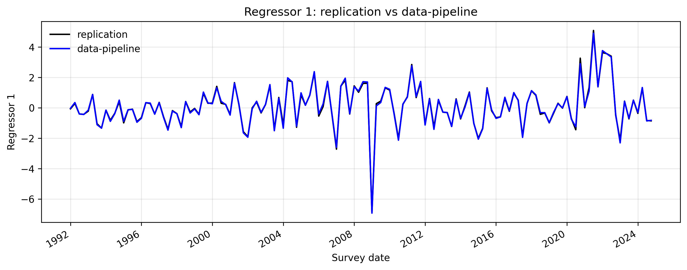
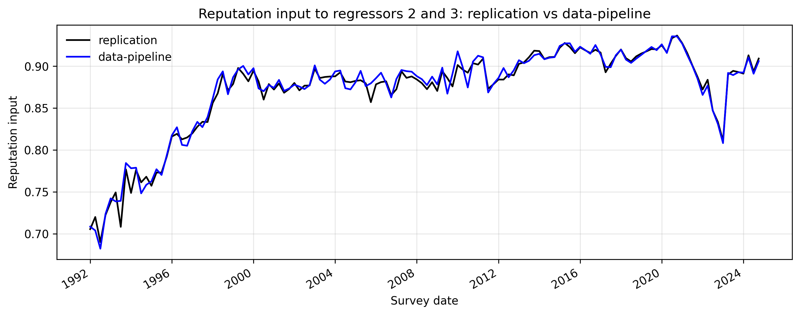

## Overview

Comparison source note.

Overlapping sample window: `1992:Q1` to `2024:Q4`.

Important dependency note:

This QMD is a static report. It does not generate the comparison figures during render. The embedded figures and comparison CSV files are produced separately by `replication/compare2data-pipeline/compare_series.py`. Re-run that Python script first if the figures or aligned comparison data need to be refreshed.

## Series Sources

Dependent variable comparison 1:

- `replication` -> `replication/replicate_figure.py` : `model_input['dCPI10mn']`
- `data-pipeline` -> `data-pipeline/src/spf_adjust.py` : `regression_dataset['r_bar']` for `x_definition='raw_cpi10'`

Dependent variable comparison 2:

- `replication` -> `replication/replicate_figure.py` : `model_input['dCPI10Cmn']`
- `data-pipeline` -> `data-pipeline/src/spf_adjust.py` : `regression_dataset['r_bar']` for `x_definition='raw_cpi10'`

Regressor 1:

- `replication` -> `replication/replicate_figure.py` : `model_input['FR0']`
- `data-pipeline` -> `data-pipeline/src/spf_adjust.py` : `regression_dataset['n_bar']` for `x_definition='raw_cpi10'`

Reputation-related survey-level input to regressors 2 and 3:

- `replication` -> `replication/replicate_figure.py` : `model_input['rhob'].shift(1)`, saved in the comparison script as `rhob_prev_like`
- `data-pipeline` -> `data-pipeline/src/spf_adjust.py` : `regression_dataset['rho_bar_prev']` for `x_definition='raw_cpi10'`

## Findings

Definition note:

These are not equivalent objects. `replication` uses a legacy survey-level reputation proxy derived from the current-quarter all-respondent `CPI10` mean and then shifted one quarter. `data-pipeline` uses the matched-sample mean of previous-survey forecaster-level `rho`.

Verified root cause note:

In `replication/replicate_figure.py`, `model_input['rhob']` is constructed from `model_input['CPI10Cmn']`. Despite the name, `CPI10Cmn` is not a continuing-member mean. It is computed as the mean of all current-quarter respondents. Therefore the replication reputation input inherits all-respondent composition changes, while `data-pipeline`'s `rho_bar_prev` is a matched-sample previous-survey mean. This naming/definition mismatch is a root cause of the reputation-input difference, and it also underlies the original `dCPI10mn` dependent-variable mismatch.

Verified long-term forecast revision root cause:

In `replication/replicate_figure.py`, the script does calculate a continuing-member change proxy via an outer merge of adjacent quarters and `np.nanmean(change)`, but that quantity is stored as `model_input['dCPI10Cmn']` and is not used as the dependent variable in the fitted figure workflow. Instead, the fitted figure uses `model_input['dCPI10mn']`, which is the first difference of the all-respondent quarterly mean `CPI10` series. This creates a built-in divergence between the more revision-like quantity already available inside the replication script and the quantity actually plotted and regressed. The separate saved comparison `compare_long_term_forecast_revision_continuing.png` supports this as a verified local root cause of why the replication dependent variable departs from `data-pipeline`'s `regression_dataset['r_bar']`.

Verified cumulative-plot start note:

With the actual raw-input data, `data-pipeline`'s `regression_dataset['r_bar']` does not begin in `1991:Q4`. Its first actual observation is `1992:Q1`, because a forecast revision requires a previous-quarter `CPI10` observation. The first fitted values in `data-pipeline` at `1992:Q1` are small negative numbers, not zeros. Therefore any apparent zero start in the plotted fitted lines is a visual impression from scale, not a property of the computed fitted series. By contrast, `replication`'s cumulative data series shows `0` at the start because `model_input['dCPI10mn']` is missing at `1991:Q4` and the code applies `np.nancumsum`, which leaves the cumulative path at zero until the first non-missing change.

## Figures

### Long-Term Forecast Revision

### Long-Term Forecast Revision, Continuing-Member Proxy

### Regressor 1

### Reputation Input

